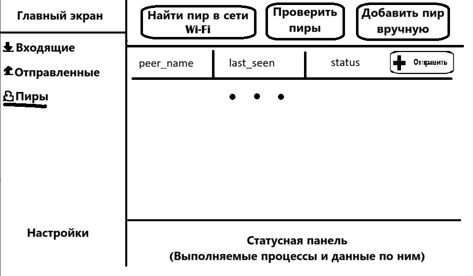

# Hermes-project
Проект приложения для передачи данных любого формата без использования постоянного сервера

## Идея
Сделать десктопную программу для быстрой, удобной передачи файлов другим пользователям. Этакий базовый файлообменник

## Стек технологий
Язык программирования - Python

Интерфейс - PySide6 / QML

Протокол P2P для передачи файлов клиента + json-ов с данными

Протокол передачи данных - gossip

Тип IP адреса для подключения к пирам - IPv6; IPv4 для подключения в локальной сети

База данных - SQLite

Криптография: cryptography (ed25519 для подписей, AES для архива с паролем, но мы скорее всего это использовать не будем)

Дополнительно к репозиторию подключен бот для уведомлений https://github.com/JustAlek24/Noti-Bot

## Разбор работы

### Сценарий первого запуска

Сначала у нас есть прайм пир, вшитый в код программы как первый и единственный существующий. Когда программа запускается вторым клиентом - она сразу начинает проверять, а прописан ли даный клиент как пир в базе данных. Логично, что записи об этом пире в бд не будет, но там уже будет лежать наш прайм пир. Наш новый пир будет стучаться к прайм пиру -> получать от него список известных пиров -> сохранять в свою бд. Сам прайм пир, когда получит пинг от нового клиента добавит его в свою бд. При следующем контакте прайм пира с кем угодно новичок разнесётся дальше.

### Базовая работа программы 

При запуске компьютера программа будет запускаться автоматически как Windows Service, ну или Daemon на линуксе. При этом будет работать только базовый функционал программы - возможность принимать сигналы от других пиров и пересылать им данные из бд пиров. Само исполняемое приложение будет включать: интерфейс типа как на mail.ru с полученными файлами, возможностью залогиниться и отсылать файлы другим изместным пирам. Новые пиры будут добавляться либо по конкретному идентификатору пира, отображаемому в приложении конкретному пользователю, либо по QR коду (для мобильных устройств, если будут).

### Сам сценарий передачи файлов (теоретический)

Есть пользователь адресат и пользователь отправитель. Для начала пользователь отправитель открывает в программе раздел "Отправленные файлы", в нём по названию понятно чё будет. Сверху вниз отсортированы сообщения об отправлении по времени от последнего до первого. Выше всех отправленных в приложении будет сообщение " + Отправить файлы". При нажатии на него создастся новое сообщение об отправлении и интерфейс переключится на окно отправления. Ниже тупорылопримитивная картинка с сообщениями об отправлениями

Далее пользователь выберет пир из списка известных или выберет пункт "Добавить новый пир", потом он выбирает конкретный файл, несколько файлов или папок, которые он собирается отправить. Когда он определился с выбором, файлы внутренним методом переводятся в зип архив, чтобы перекидывать эту штуку было проще. При желании на архив можно поставить пароль, тогда этот архив будет зашифрован до момента получения адресатом. Далее, когда архив готов к отправлению, адресату по IPv6 адресу отправляется json файл с метаданными о запросе на передачу данных. Если пир адресата жив и активен, адресат получит уведомление и оно будет висеть на главной странице приложения как непрочитанное письмо в mail.ru (не как push уведомление, которое можно смахнуть и убрать, это будет как любое письмо в почте. Это будет такая строка-полоска с ником пира-отправителя, кратким описанием файлов для передачи и тд.). Если пир мёртв или не в сети, никакого уведомления он не получит и даже запроса от отправителя до него не дойдёт, именно поэтому необходима реализация Windows Services. В таком случае отправитель получит уведомление, что пир не в сети, и неотправленный запрос сохраняется локально со всеми данными для отправки. Если уведомление дошло до адресата, он может открыть уведомление (тупо нажав на него), затем интерфейс переключится на страницу принятых файлов (она разная по содержанию для каждой отправки/приёмки, но одинаковая по оформлению), там посмотреть содержимое архива, всю подробную информацию о пире-отправителе, метаданные всякие. Затем он может выбрать, принимать ли передачу файлов или нет. Если передача принимается, отправляется json сообщение пиру-отправителю для начала отправки архива, в том же окне у адресата появится полоска загрузки файлов и все отчёты по загрузке. Если передача не принимается, отправителю идёт json сообщение с отказом от приёма файлов и оно отображается пользователю в окне отправки. Данные о передаче всё ещё остаются у адресата, как и само уведомление в общем списке, но оно всё удалится через какое-то время, например через неделю. Когда файл загружен, он будет разархивирован. Архив с паролем разархивирует файлы только по паролю. Лежать файлы будут в определённой папке программы. Для каждой приёмки будет создаваться своя папка, подписанная названием передачи и датой. Открыть полученные файлы можно будет прямо из интерфейса принятых файлов.

### Ограничения

-  Пиры не могут всегда быть онлайн, поэтому достучаться до них будет не всегда возможно.
-  NAT и CGNAT сети мешают прямому P2P через IPv4 (они везде)
-  Передача по P2P через IPv4 возможна только локально в одной Wi-Fi сети
-  Передача по мобильному интернету возможна тоже только с IPv6
-  Антивирус будет ругаться на Windows Services

### Решения

-  bootstrap peer, асинхронные запросы к пирам, очереди запросов, повторные попытки, пинги по таймеру
-  Будем миксовать IPv6 и IPv4, один для локальных сетей, второй для всех

### Важные темы для изучения

-  Сокеты (python socket ipv6 tutorial)
-  Широковещательная рассылка (python udp multicast example)
-  Gossip-протоколы (gossip protocol explained)
-  Асинхронность (asyncio, threading)
-  IPv6 в Python — специфика работы с AF_INET6, мультикаст-группы
-  Windows Service / systemd
-  Криптография (подпись сообщений, проверка подлинности пира)

## GUI

Наполнение: две панели - боковая (левая) и главная

Левая панель чисто под переключение главной панельки и открытия дополнительных окон. Там будут кнопки "Входящие", "Отправленные", "Пиры", "Настройки", "О  программе". "Входящие" по умолчанию будут главным экраном (ну или может главный экран будет отдельным, как начальная страница).

### Главный экран - входящие / отправленные

Панели входящих от отправленных не будут отличаться видом, только подгружаемыми данными.
 
На главном экране будут такие блоки сверху вниз: в самом верху кнопка "Отправить", затем ниже скрол панель с сеансами передачи/принятия файлов, ещё ниже - статус панель с информацией по процессам, происходящим в проге (активные подключения/передачи/приём файлов).

### Главный экран - пиры

Тут на главной панели в верхнем блоке будут кнопки: 
1) Найти пир в сети Wi-Fi, которая запускает UDP broadcast
2) Проверить пиры, которая запускает пинг ко всем известным ip адресам. Функция из heartbeat, но без таймера, а по кнопке.
3) Добавить пир вручную, по нажатию которой открывается окно добавления пира пользователем

Ниже будет список известных из бд пиров. Конкретно там будут поля peer_name, last_seen, status. Можно закинуть кнопку отправить в самый конец, а можно и без неё обойтись. При нажатии на поле из этого списка будет открываться окно со всеми данными об этом пире из бд, с ip и портом для общения. Сюда же можно воткнуть кнопку для быстрой отправки файлов пиру.   Также будет скрол список всех контактов с пиром и отображение всех запросов, как успешных, так и неудачных.

## Протокол передачи данных

## Архитектура приложения

## Структура проекта

## Безопасность

## Прототип на коленке - v0.0

Включает: скрипт отправки/ принятия файла по TCP в локальной сети через IPv4
Gui не будет, не будет бд. Тупо указал в коде адрес, отправил, получил.

## MVP (Minimum Value Project - Минимальный рабочий продукт) v1.0

Как первая рабочая версия программа должна включать:

1) Базу данных SQLite "Peer" с полями:
-  peer_id TEXT PRIMARY KEY - уникальный айдишник пира
-  peer_name TEXT - юзернейм пользователя
-  ip TEXT - айпи адрес пира
-  port INTEGER - порт для передачи данных
-  last_seen INTEGER - дата последней активности пира timestamp. НИ В КОЕМ СЛУЧАЕ НЕ ПЕРЕДАВАТЬ ДРУГИМ ПИРАМ!!! Это локальная штука, хранящаяся в памяти чисто для отображения в GUI. Т.к. у нас будет dict status для отображения online/offline пира, last_seen будет меняться только если пир замечен онлайн при каждом heartbeat. В бд заносим обязательно.
-  updated_at INTEGER - дата последнего изменения данных о пире
-  version INTEGER - версия записи в бд

2) Обнаружение пиров через UDP Broadcast в локальной сети. Это будет работать как дополнительный способ обнаружения пиров
3) При обнаружении пира они обмениваются всеми своими известными пирами (вообще вся бд пересылается)
4) Heartbeat с отправкой сигналов известным пирам и обновлением last_seen
5) Ассинхронная передача по TCP
6) Базовый Gui
7) Список status с отображением состояния пиров (online/offline/unknown). Лучше так, а не в бд, потому что бд придётся обновлять слишком часто, а в списке статус будет обновляться при каждом пинге heartbeat-а. Эти данные потом будут и в GUI отображаться
8) Рабочий процесс обработки запросов с подтверждением получения. Acknowledgement для json файлов обязателен

## MVP v1.1

1) передача части бд, а не всей бд целиком.
2) version в бд начинает обновляться
3) updated_at тоже записывается вместе с обновлением version
4) при возникновении конфликтов передачи от нескольких пиров побеждать будет тот, у кого больше updated_at
5) ручной ввод пира для сохранения в бд
6) обработка ошибок передачи пакетов

## MVP v2.0

1) Определение IPv6
2) В поле IP таблицы Peer хранится IPv6
3) Соединение пиров перейдёт на IPv6
4) bootstrap peer переписывается на IPv6
5) gossip через IPv6 из бд
6) Автоопределение в бд IPv4 и IPv6 для разного типа подключений (Можно вырезать IPv4 в принципе)
7) Верификация через ed25519

## Daemon интеграция

## Мобилка

1) Переписывание GUI на андроиды

## Будущие идеи

### Темы для изучения (безопасность) ((накидала нейронка))

TLS/Noise Protocol — шифрование всего канала передачи данных между пирами. Сейчас сообщения летят открытым текстом, любой в той же Wi-Fi сети может перехватить и прочитать. TLS решает эту проблему, но настройка сертификатов и handshake — нетривиальная задача.

Защита от replay-атак — когда кто-то перехватил сообщение и отправил заново. Решается через nonce (уникальный номер сообщения) или timestamp с проверкой что сообщение не старше N секунд.

Целостность файлов — SHA256 хэш от файла. Отправитель считает хэш, вкладывает в META, получатель считает свой хэш и сравнивает. Если не совпадает — файл повреждён при передаче.

Валидация входящих данных — проверка JSON на валидность, проверка что поля не пустые, что IP адрес корректный, что peer_id существует. Без этого можно получить краш на кривом сообщении от другого пира.

Noise Protocol — альтернатива TLS, проще в реализации для P2P. Используется в WireGuard, Signal. Стоит изучить если TLS окажется слишком тяжёлым.

Forward secrecy — одноразовые ключи сессий. Даже если приватный ключ пира будет скомпрометирован в будущем, старые сессии останутся зашифрованными.

Web of Trust — модель доверия между пирами без центрального CA. Каждый пир подписывает ключи тех, кому доверяет, и так формируется сеть доверия.
